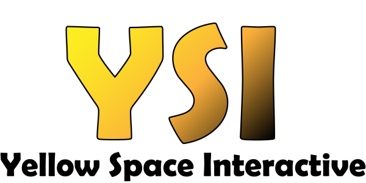

# Hello, I’m @int91 also known as c_onvulse.

### Table Of Contents
- [About Me](https://github.com/int91#a-little-about-me)
- [Development History](https://github.com/int91#my-development-history)
- [My Current Project](https://github.com/int91#my-current-project)

### A Little About Me
I am a former Professional Esports Competitor across the following games:
- Supraball
- Rogue Company
- Phantom Forces (Yes the Roblox game)
- Bad Business (Yep another Roblox game)

I have played video games my whole life almost, starting back when I was only **3** years old.
I still play games all the time and am currently doing a "Road to GC" series in [Rocket League Sideswipe](https://sideswipe.rocketleague.com/) over on my [Twitch](https://www.twitch.tv/c_onvulse).
I stream nearly everyday and I plan to keep it up the best I can. I also coach players in Rocket League Sideswipe. If you are looking for coaching or just any tips to improve feel free to join my [discord server](https://discord.gg/fbgUBBVub6).

### My Development History

I started Programming back in 2017 with C#. I taught myself how to make simple projects like 8-ball programs and mini-text adventure games. 
I taught myself through various online resources, one of those being YouTube of course.
I now try my best to **not** use YouTube as a resource for programming and stick to books or the specific language's/engine's documentation.
I believe that using YouTube with a certain mindset when trying to learn will produce a form of linear problem solving ability.
In programming it's ideal to not only learn your preferred language, but to also master problem solving, whether it's through techniques like narrowing things down to the minimal
components or just figuring out how to solve the problem through consistent methodology. You **need** to be able to solve problems when programming.

I have created numerous projects shown in the table below.

| Project  | Language / Engine |
| ------------- | ------------- |
| [Buy Sell Trade](https://convulse.itch.io/bst-oldgame) | C# Console App |
| [Falling Cubes *Original*](https://convulse.itch.io/fallingcubesagk) | 2D Game Made In App Game Kit + AGKBASIC  |
| [Falling Cubes *Lua Version*](https://convulse.itch.io/fallingcubesle) | 2D Game Made In Love2D |
| [Falling Cubes *Python Version*](https://github.com/int91/FallingCubes-Python) | 2D Game Made In Python + pygame |
| [Bank Manager App](https://github.com/int91/BankManagerApp) | Simple Application Made In Python |
| [Untitled RPG Game](https://convulse.itch.io/urpg) | Small GUI Driven RPG made in Godot (Password to view page is "github")|
| [OffPass - Account Manager](https://convulse.itch.io/offpass) | Account Manager Made In Godot + gdscript |
| [Case Simulator](https://github.com/int91/case-simulator) | 2D Gambling Game Made In Godot + gdscript |
| [PC Shop Tycoon](https://github.com/int91/PcShopTycoon) | Really Old Unity Game Made In C# + Unity |
|^ updated as of December 17th, 2021 | |

I'm currently learning multiplayer game development with [Godot Engine](https://godotengine.org/).

### My Current Project

Details about my current project can be found [here](invictusinfo.md) |
 [invictusinfo.md](invictusinfo.md)

The project trello can be found [here](https://trello.com/b/4JIAz9v0/project-invictus-board)
 | [https://trello.com/b/4JIAz9v0/project-invictus-board](https://trello.com/b/4JIAz9v0/project-invictus-board)

I'm making my project under the studio

